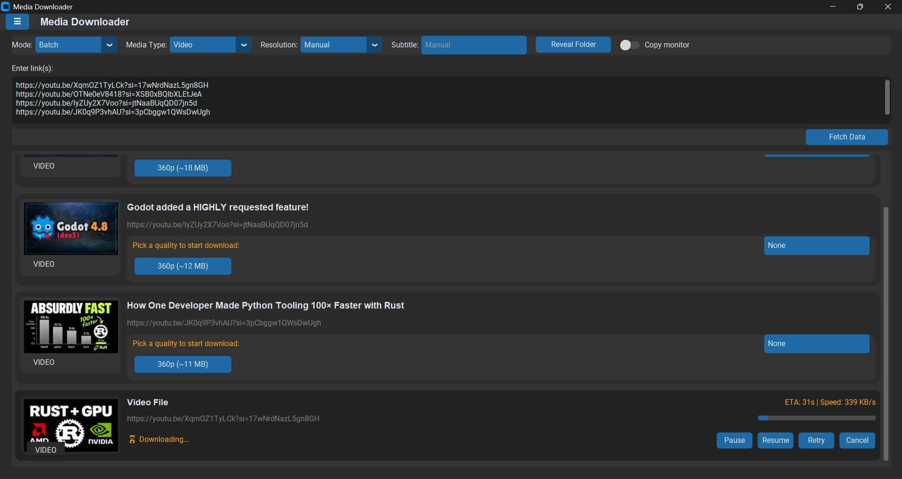
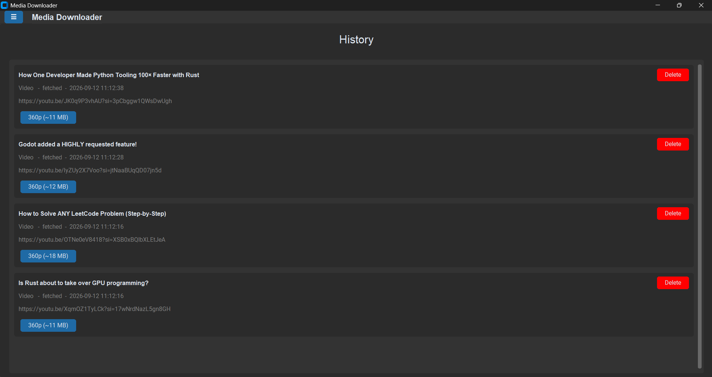
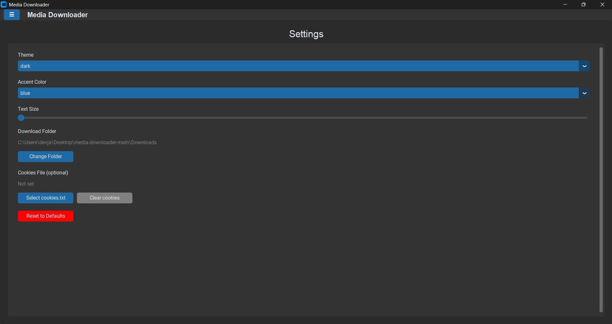

# 🎬 Media Downloader (Desktop GUI)

A modern desktop media downloader built with **Python + CustomTkinter**, powered by **yt-dlp**.

Downloads video, audio, and images from any site supported by yt-dlp, with resolution selection, subtitle downloads, batch URL support, and full control over each download (pause / resume / retry / cancel).

This project focuses on real-world reliability — not just "works on my machine."



## ✨ Features

**Core**
- ✅ Download video, audio, or images from any yt-dlp-supported site
- ✅ Manual resolution selection per link
- ✅ Subtitle download when available
- ✅ Single-link and batch (multi-link) downloading
- ✅ Pause / Resume / Retry / Cancel per download
- ✅ Live progress, download speed, and ETA per item

**Navigation**
- ✅ Sidebar with Dashboard, Downloader, History, and Settings
- ✅ Dashboard originally showed live statistics, but was simplified to reduce load on the app
- ✅ History page lists every previously fetched URL, with quality buttons to re-download

**Settings**
- ✅ Theme and accent color selection
- ✅ Adjustable text size
- ✅ Custom download folder
- ✅ Optional cookies.txt support (for sites that require login/consent)
- ✅ Reset to defaults

## 🖼️ Screenshots

| Downloader | History |
|---|---|
|  |  |

| Settings |
|---|
|  |

## 🛠️ Tech Stack

- Python 3.10+
- CustomTkinter (UI)
- yt-dlp (download engine)
- FFmpeg (audio/video processing)

## 📦 Requirements

```bash
pip install yt-dlp customtkinter
```

Install FFmpeg and make sure it's available in your system PATH.

## ▶️ Run the App

```bash
python main.py
```

## 🍪 Cookies (recommended for some sites)

Some platforms (including YouTube) require login, consent, or age verification for certain videos. If a download fails or shows limited resolutions, add a `cookies.txt` file from the Settings page — this fixes most "403 Forbidden" or "only images available" errors.

## ⚠️ Known Limitations

- Some formats require an account or region access and won't be available
- DRM-protected streams cannot be downloaded

## 🚀 Planned Features

- Download queue prioritization
- Separate audio-language selection
- Playlist manager UI
- Per-site download statistics

## 🧑‍💻 Author

Built by **Jamshidbek Foziljonov**
GitHub: [dev-jamshidbek-NiM](https://github.com/dev-jamshidbek-NiM)

## 📜 Disclaimer

This tool is for educational and personal use only. Respect the terms of service and copyright laws of the platforms you download from.
